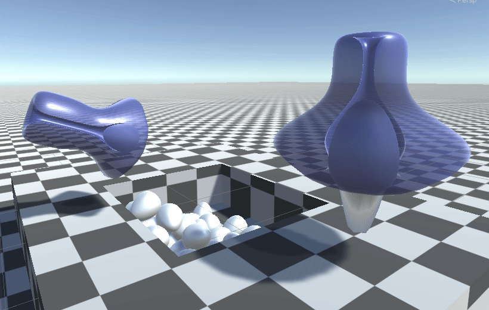

 This repo contains nsfw code as examples. If you're under 18 please leave. 

# Unity Penetration Tech

A gpu-based deformation system for mapping penetrators along orifice paths.



# Features

* Bezier curve based orifice definitions.
  * Arbitrary soft turns and bends!
  * Allows for all-the-way-through deformations.
  * Orifaces can be two-way, or one-way with over-penetration protection.
* Cross-sectional girth and offset analysis.
  * Analytical push/tug forces that really make things **pop**.
  * Approximates offsets needed to ensure things line up, even on wiggly/crooked shapes.
* Supports physics simulations!
  * Ragdolls react to kinematic penetrations, and attempt to position themselves in a sane way.
* Many simultaneous penetrations!
  * Uses a deterministic circle packing algorithm to fit many penetrators into the same orifice.
* Arbitrary blendshape deformation support.
  * Make penetrators wiggle, pulse, squish, stretch, and bulge: things will react to it!
* Uses an Amplify Shader Editor node in order to do all of the deformation calculations.
  * Write your own shaders that support it!
* Advanced clipping features.
  * Penetrators get pinched and turned invisible within opaque orifices.
* Supports LODGroups!
  * Meshes can be built out of many pieces, with many lod groups-- yet everything still works properly!
* Depth events for both orifice and penetrators. On tug and push.
  * Trigger sounds, particles, animations, or whatever else. Give both orifices and penetrators unique personalities.

# Limitations

* Since orifices can only be defined with a single bezier curve, proper xy-offsets get very difficult to calculate. Try to keep penetrators completely along one axis, otherwise they might clip strangely.
* Penetrators use UV2.w, UV3, and UV4 to bake blendshapes for the shader to read. This limits three things:
  * Penetrators shouldn't have blendshape normals (They can be disabled in the import settings).
  * Penetrators MUST have these three blendshapes available, even if they're unused: `DickSquish`, `DickPull`, `DickCum`.
  * Penetrators are extremely sensitive to having correct normals and tangents (for in-shader tangent space calculations). Playing with the Normals and Tangent import settings is almost required because there's many configurations that gets this incorrect.
* This system is *immensely* complicated, I needed it to cover a huge number of use cases. It's NOT easy to use. Feel free to contact me for help!

# Tutorial

A tutorial won't be featured here due to the sensitive nature of the content. One will be posted to my gumroad shortly. (and a link will appear here when it does)
This example project could be enough for some to get started, though!

# Installation

Simply add `https://github.com/naelstrof/UnityPenetrationTech.git#upm` as a package using the package manager.

Or if that doesn't work, add it to the manifest.json like so.

```
{
  "dependencies": {
    "com.naelstrof.penetrationtech": "https://github.com/naelstrof/PenetrationTech.git#upm",
  }
}
```